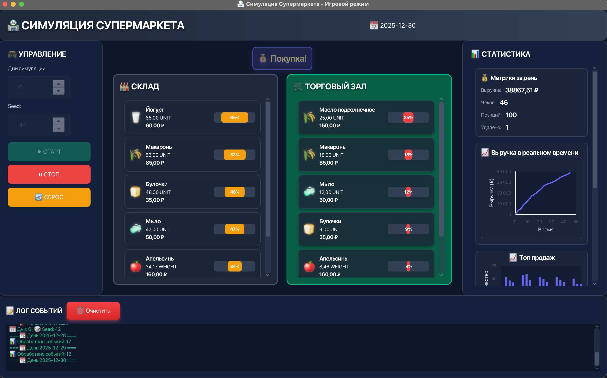
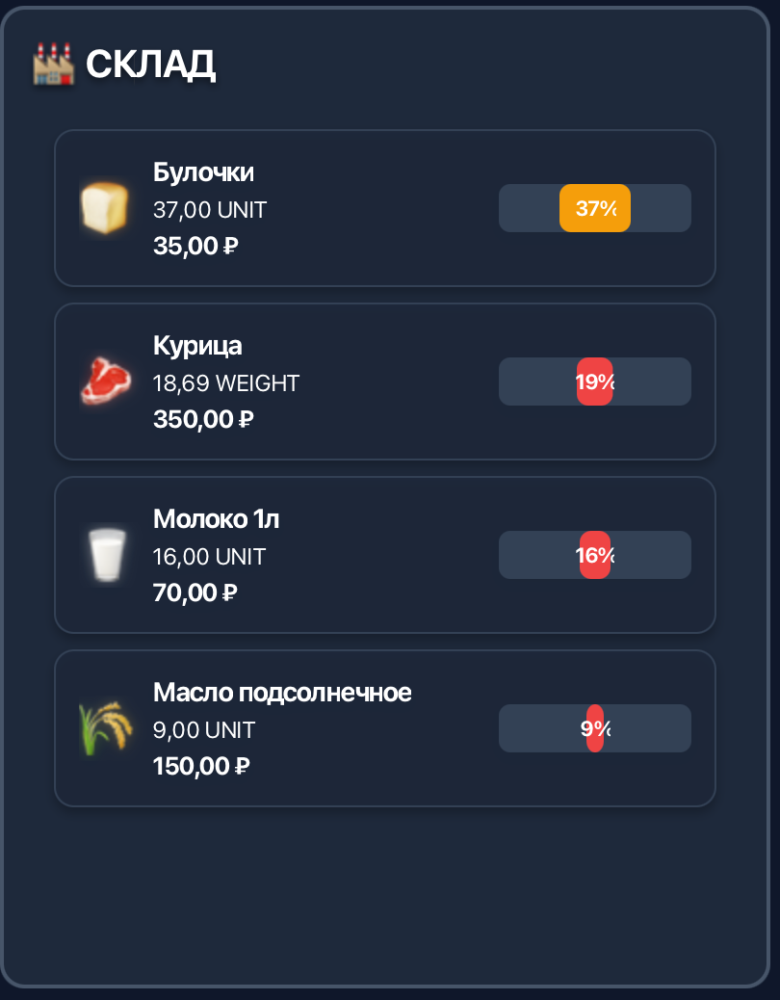
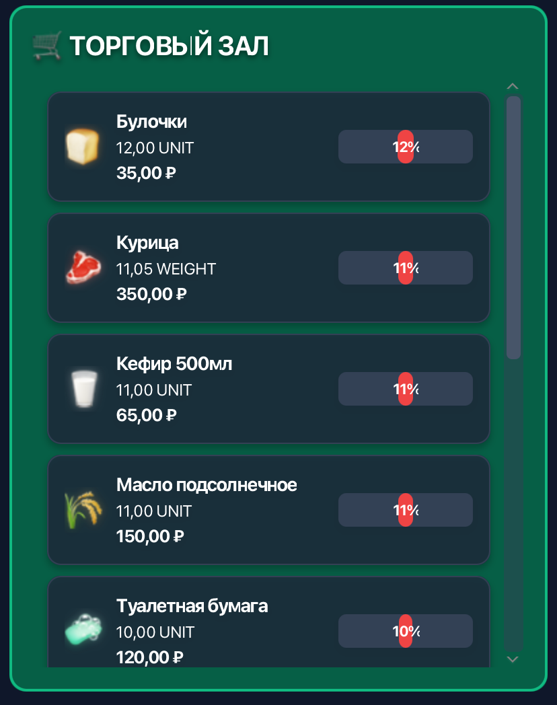
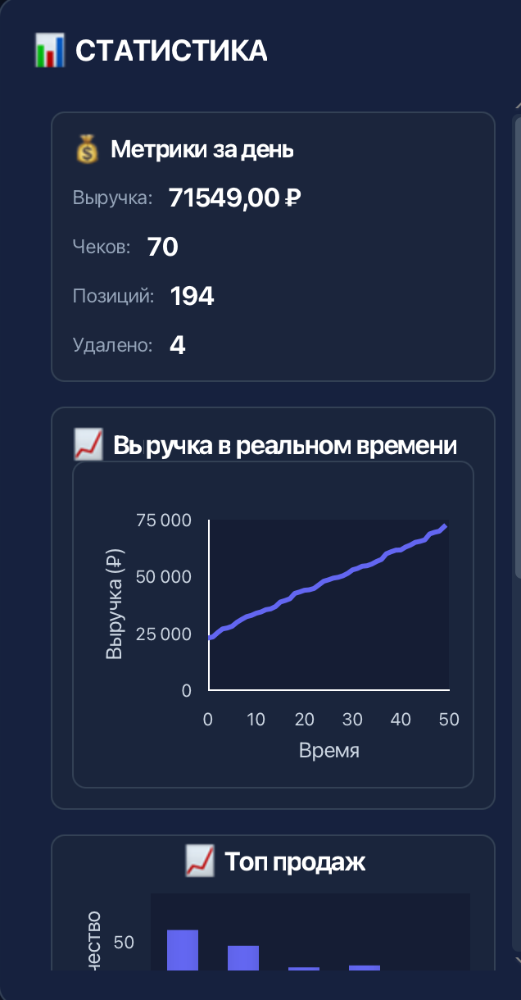

# Симуляция супермаркета

Проект состоит из двух модулей:

## Структура проекта

### `engine/` - Движок симуляции
Содержит всю логику симуляции супермаркета:
- **core/** - Основные классы движка (SimEngine, Clock, EventQueue и т.д.)
- **domain/** - Доменные модели (Product, Inventory, Lot и т.д.)
- **events/** - События симуляции (DeliveryEvent, PurchaseEvent и т.д.)
- **pricing/** - Логика ценообразования и скидок
- **reporting/** - Статистика и отчёты
- **people/** - Модель покупателя

### `gui/` - Графический интерфейс
JavaFX приложение с игровым интерфейсом для визуализации и управления симуляцией:
- **GameApp** - Главное JavaFX приложение
- **ControlPanel** - Панель управления (старт/стоп/сброс, настройки)
- **StoreView** - Визуализация склада и торгового зала с интерактивными карточками
- **StatsPanel** - Статистика за день с графиками в реальном времени
- **LogPanel** - Лог событий симуляции
- **ProductCard** - Интерактивные карточки товаров с hover эффектами
- **ProductDetailDialog** - Модальные окна с детальной информацией о товарах
- **RevenueChart** - График выручки в реальном времени

## Сборка и запуск

### Установка модулей в локальный репозиторий (необходимо перед первым запуском):
```bash
mvn clean install
```

### Сборка всех модулей:
```bash
mvn clean package
```

### Запуск GUI приложения (JavaFX):

**Способ 1: Используя JavaFX Maven Plugin (рекомендуется):**
```bash
mvn javafx:run -pl gui
```

**Способ 2: Используя exec plugin:**
```bash
mvn exec:java -pl gui
```

**Способ 3: Из папки gui (после установки модулей):**
```bash
cd gui
mvn javafx:run
```

**Важно:** Перед первым запуском обязательно выполните:
```bash
mvn clean install
```
Это установит модуль `engine` в локальный Maven репозиторий, что необходимо для работы GUI.

### Запуск CLI приложения (старый Main):
```bash
cd engine
mvn exec:java -Dexec.mainClass="ru.vsu.cs.oop.pronin_s_v.task2_retail_store_sim_java.Main" -Dexec.args="3 42"
```

## Скриншоты

### Главный экран

Основной интерфейс приложения с отображением склада, торгового зала и статистики.

### Склад с товарами

Визуализация товаров на складе с карточками продуктов.

### Торговый зал

Товары в торговом зале, доступные для покупки.

### Статистика

Панель статистики с графиками и метриками.

### События в действии

Уведомления о событиях и лог активности.

## Зависимости

- GUI модуль зависит от engine модуля
- Engine модуль - независимая библиотека
- Все модули используют Java 21
